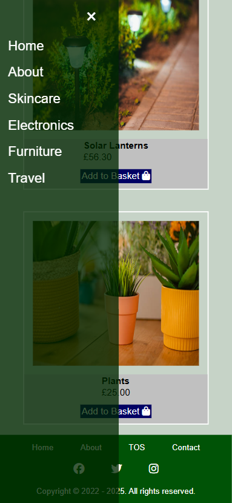

# eCommerce
This is a multi-page static e-commerce site built with **HTML5**, **CSS3** and a touch of **JavaScript**. The eCommerce project focused on practicing layout, navigation and responsive UI designs.

## Quick Setup
Because this is a static site, you can run it locally in seconds.

**1. Clone the Repository:**
Download this project [here](https://github.com/vkumar-2/eCommerce/archive/refs/heads/main.zip "here") **or** enter the following in command line:

```bash
git clone https://github.com/vkumar-2/eCommerce.git
cd eCommerce
```

**2. Open folder:**
Open the eCommerce zip folder, locate file **home.html** and double click it to run.

## Tech Stack
#### HTML5:
- **Elements** - semantic tags (e.g. header, nav, main, section) used for improving SEO and readability.
- **Anchors** - standard anchor links (`<a> </a>`) for navigating between pages, simulating a multi-page real eCommerce flow.
- **Forms** - forms and input elements (e.g. during checkout and contact) where users enter and submit information.
- **Lists** - mixture of ordered and unordered lists for grouping navigation items, categories and structureed content.
- **Images** - stock images (from [iStock](https://www.istockphoto.com/ "iStock")) embedded with `` to improve UX and overall presentation.

#### CSS3:
- **Classes** - used throughout the site for maintaining consistent designs across pages.
- **Flexbox & Grids** - modern layouts used to align content and organise products in a clear and scalable way.
- **Media Queries** - used for maintaining responsive web pages across different viewports and screen sizes.

#### JavaScript:
Used for adding an interactive sidebar when site is ran on different viewport sizes (e.g. smartphones and tablets).

## Images
### Desktop Display:
#### Homepage:


#### Categories:


#### Travel:


### iPad Display:
| Fragrances | Skincare |
| ------------ | ------------ |
|   |  |

### Smartphone Display:
| Furniture | Contact Form |
| ------------ | ------------ |
|   |  |
